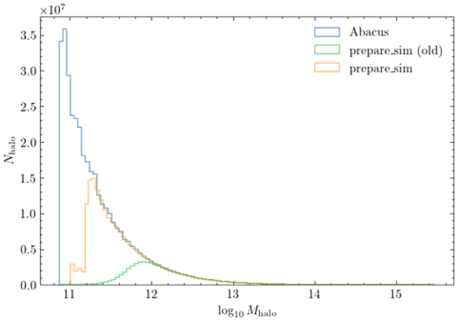

CorrHOD_cubic
=============

For the utility of the class, see its desctiption in the `API`_ section below.

Before using the class
----------------------
As we will be using the AbacusSummit Dark Matter simulations, 
AbacusHOD requires to prepare these simulations.

.. warning::
   Without this step, the simulation creation will fail.

To do so, you need to follow the instructions in the 
`AbacusHOD documentation <https://abacusutils.readthedocs.io/en/latest/hod.html#short-example>`_.

The BGS filter
~~~~~~~~~~~~~~

The ``prepare_sim`` script is scaled for LRG galaxies. For computational reasons, a filter [#]_
is applied to the halo catalog to remove the light halos that will not be populated. 
However, the Bright Galaxy Survey (BGS) galaxies has lower mass conditions than LRGs. 
Therefore, the filter needs to be changed.

   The Halo mass distribution for different filters (blue for the halo catalog, yellow for BGS
   and green for LRGs)

The ``prepare_sim.sh`` file in the ``scripts`` folder is the script used to prepare the BGS simulations.

.. warning::
   The ``prepare_sim.sh`` script and ``prepare_sim_bgs.py`` script are not included in the package, as
   they are supposed to be included in the AbacusHOD package. However, they are available in the
   ``scripts`` folder of the `GitHub repository <https://github.com/SBouchard01/CorrHOD>`_.

The script needs as an imput a config file (the same as AbacusHOD), with the path to 
the dark matter simulation in ``sim_dir``, the name of the simulation we want to prepare in 
``sim_name`` and the path in which the prepared simulation will be saved in ``subsample_dir``.
(see ``config\config.yaml`` for an example, and 
`AbacusHOD <https://abacusutils.readthedocs.io/en/latest/hod.html#short-example>`_ 
for more details).

.. note::
   The only difference between the LRG and BGS scripts are the ``subsample_halos`` and ``submask_particles``
   functions. 

How to use the class
--------------------

Initialization of the class
~~~~~~~~~~~~~~~~~~~~~~~~~~~

First, you need to create a config file for AbacusHOD. 
See the `AbacusHOD documentation <https://abacusutils.readthedocs.io/en/latest/hod.html>`_ for more details.

Then, you need to create a HOD dictionnary that contains the following parameters 
(provided here with a random set for example):

::

   {'Acent': 0,
   'Asat': 0,
   'Bcent': 0.30609746972148444,
   'Bsat': -0.0737193257210993,
   'alpha': 0.8689115800548024,
   'alpha_c': 0.7700801491165564,
   'alpha_s': 1.036122317356142,
   'ic': 1,
   'kappa': 0.3005439816787442,
   'logM1': 13.481589622029889,
   'logM_cut': 13.274157859189234,
   's': 0,
   's_p': 0,
   's_r': 0,
   's_v': 0,
   'sigma': 0.00011413582336912553}

The CorrHOD_cubic class can then be initialized ::

   from CorrHOD import CorrHOD_cubic

   Object = CorrHOD_cubic(config_file, HOD_dict)

   Object.initialize_halos() # Load the halos catalog

   Object.populate_halos() # Populate the halos with galaxies

From that point, you can use the different methods of the class to perform different analysis.

.. tip::
   The analysis can be performed on a pre-existing catalog. To do so, you need to either use the 
   ``set_cubic`` method, or pass the catalog to the ``cubic_dict`` variable after initialization.

   .. note::
      In that case, no ``HOD_dict`` is needed in the initialization, as no simulation is computed. 
      However, due to the construction of the class, the config file for AbacusHOD 
      still needs to be passed and valid.

.. note::
   The class initialization can also take a line of sight, a boxsize and a cosmology 
   as arguments. See the API for more details.

Getting the positions
~~~~~~~~~~~~~~~~~~~~~

The CorrHOD code is designed to work for BGS only, but should *in theory* work for all AbacusHOD tracers.
Only galaxies of this tracer will be populated in the simulation, and only one tracer can be used at a time.
The tracer used can be changed in the ``tracer`` variable ::

   Object.tracer = 'LRG'

.. tip::
   The ``tracer`` parameter is set to 'LRG' because the HOD model has the same functions for BGS and LRG, 
   so only 'LRG' is coded in AbacusHOD.

The ``get_tracer_positions()`` method can then be used to get the positions of the galaxies in the catalog.
This will also apply the Redshift Space Distortion (RSD) to the positions.

::
   
      Object.get_tracer_positions()

.. warning::
   This step is important, as the positionnal array returned in the class by this function 
   will be used for all the analysis.

Downsampling the catalog
~~~~~~~~~~~~~~~~~~~~~~~~

For computational reasons, the number of galaxies in the catalog can be too big, causing the 
Correlations functions to take too much time to compute.

While CorrHOD supports multiprocessing and MPI (see the `Parallelism`_ section), downsampling the catalog
can be a good way to reduce the computation time, without loosing too much information.

The :func:`.downsample_data` method can be used to uniformly downsample the catalog ::

   new_nbar = 1e-3 # New number density of galaxies
   Object.downsample_data(new_n=new_n) 

Paralellism
~~~~~~~~~~~

API
---

.. automodule:: CorrHOD.cubic
   :members:
   :undoc-members:
   :show-inheritance:

.. rubric:: Footnotes

.. [#] see `Yuan et Al. (2021) <https://arxiv.org/pdf/2110.11412.pdf>`_ eq.13 for more details.