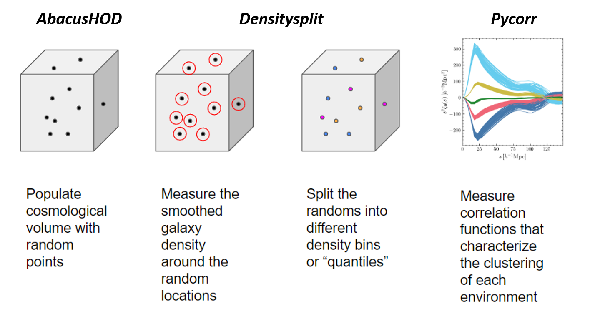

Usage
=====

Python
------

The CorrHOD module contains two classses: ``CorrHOD_cubic`` and ``CorrHOD_cutsky``.
They both import the AbacusSummit Dark Matter Halos and populate them with galaxies using the provided HOD parameters.
To do so, the classes need a config file with the AbacusHOD format. A HOD dict also can be provided 
(if not, the HOD parameters in config file are used).

The ``CorrHOD_cubic`` class populates a cubic box with periodic boundary conditions, while the ``CorrHOD_cutsky`` class 
turns that box into a lightcone with a given redshift range and sky area.

.. warning::
    The ``CorrHOD_cutsky`` class is still in development and has not yet the ability to create and populate halos.
    However, it can read galaxy catalogs and performn the analysis. (see :doc:`examples/cutsky`)

They have methods to perform Two Point Correlation Functions (2PCF) and DensitySplit analysis. 

.. note::
    The DensitySplit is based on `Paillas et al. (2022) <https://arxiv.org/pdf/2209.04310.pdf>`_.

    The CorrHOD pipeline

The two classes can be imported in Python with ::

    from CorrHOD import CorrHOD_cubic, CorrHOD_cutsky

Other useful functions are available, thehe full API of the other modules can be found here: :doc:`source/api`.

Several examples can be found in the :doc:`examples` folder.